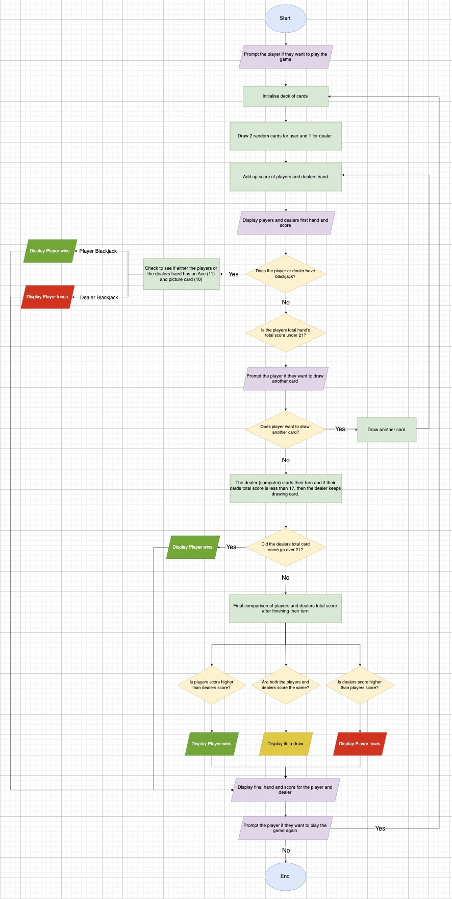
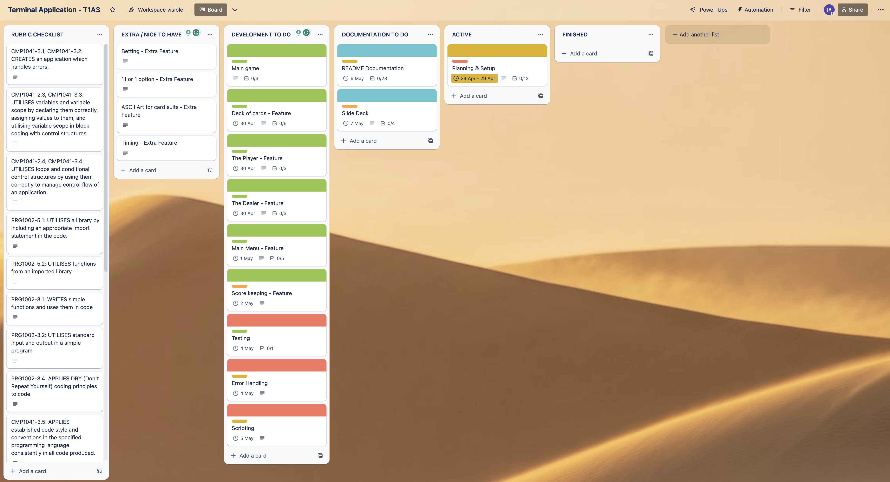
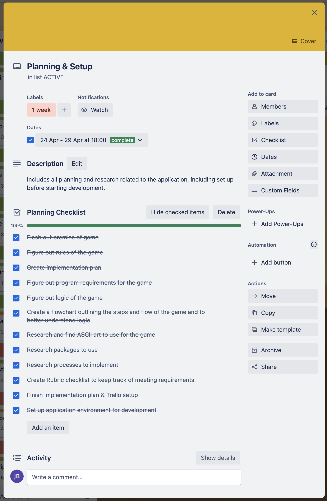
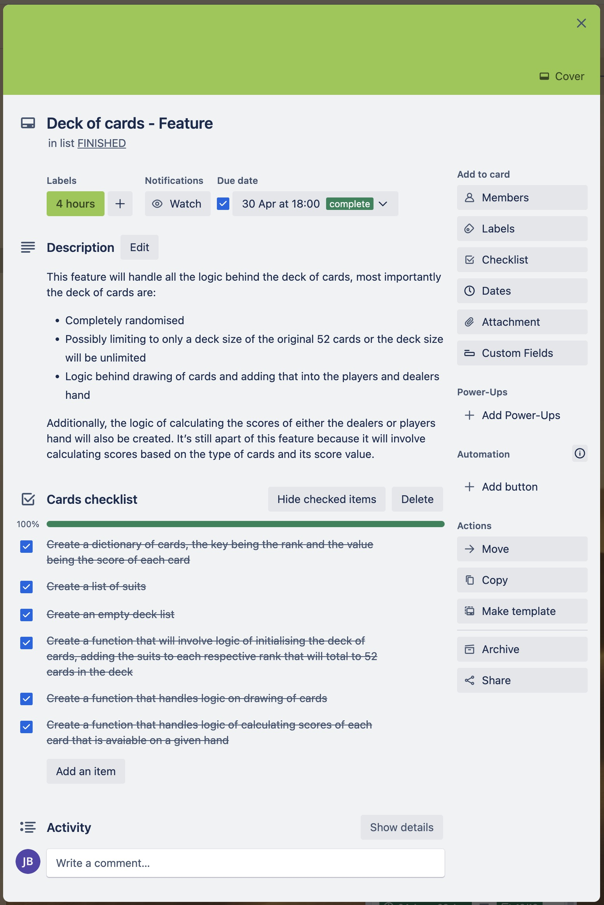
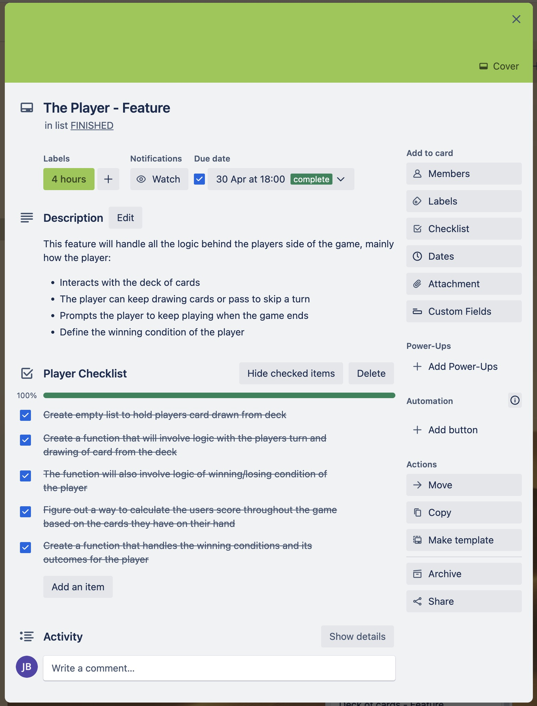
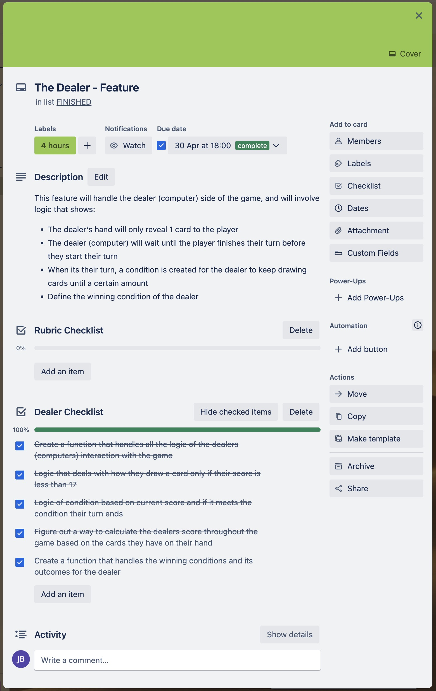
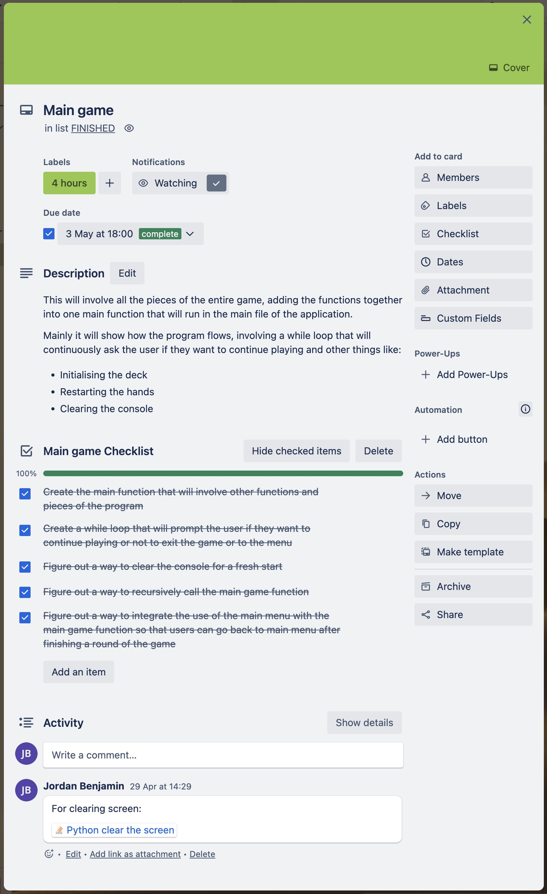
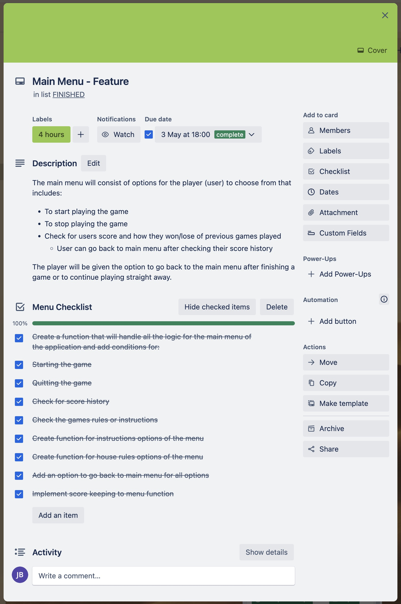
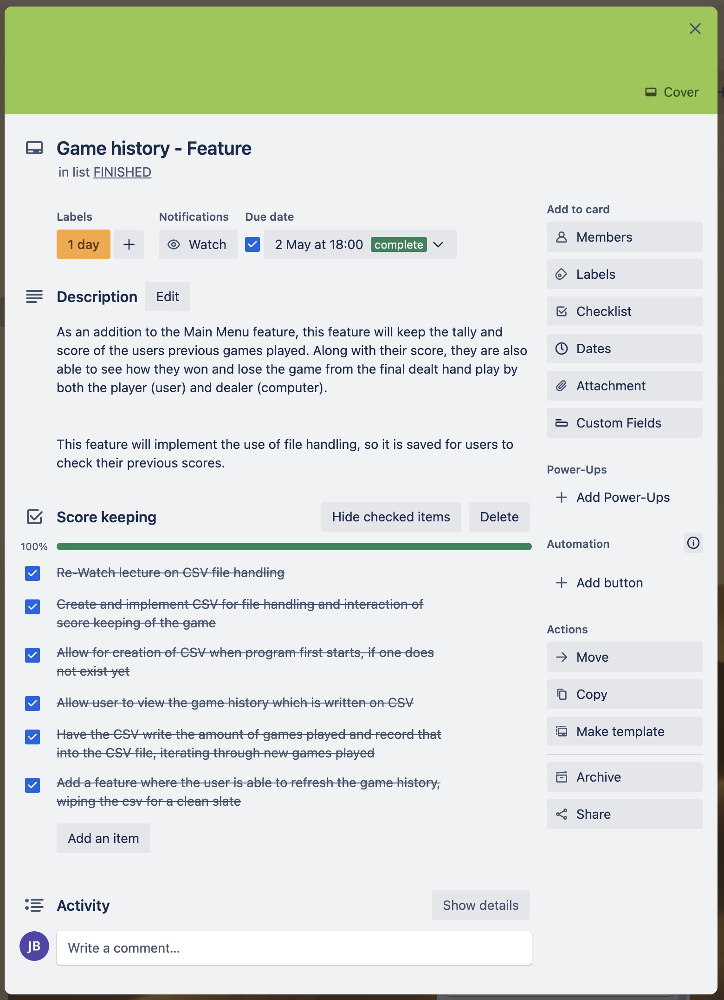
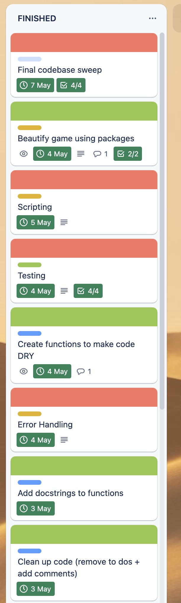

# Blackjack Python Terminal App

## For convenience

### [GitHub Repo](https://github.com/jordansbenjamin/Blackjack_terminal-app)

### [Presentation](null)

### [Trello board](https://trello.com/b/In1uFmIe/terminal-application-t1a3)

---

## The Premise

Blackjack fun right on the terminal, the premise is simple, try and get to 21 as close as possible without going over. This application will be a stripped down version of blackjack, with house rules made specifically for this version of the game.

### House rules

- The deck size is the original 52 cards including suits.
- The Jack/Queen/King all count as 10.
- The Ace can count as 11 or 1.
- There are no jokers.
- The deck of cards will be shuffled before starting a game.
- Cards are removed from the deck as they are drawn.
- The dealer is the computer.
- If the player wins/lose the game before dealer starts their turn, the dealer only reveals one card. Unlike traditional Blackjack, where the dealer reveals their second card at the end of the game.

---

## Installation Guide

### System Requirements

To play the Blackjack program, since its a terminal application built on Python. It is a requirement that **Python 3** is installed on your computer.

If you don't have Python 3 already installed, please follow visit this [*website*](https://realpython.com/installing-python/) for steps on installing Python 3 to your device and operating system of choice.

Please make sure have **Python 3.11+** version installed.

Operating System requirements to run Python:

- Windows 7,10 or 11
- Mac OS X 10.11 or higher, 64-bit
- Linux: RHEL 6/7, 64-bit (almost all libraries also work in Ubuntu)
    - x86 64-bit CPU (Intel / AMD architecture)
    - 4 GB RAM
    - 5 GB free disk space


You can check which version of python is installed or if you have it installed at all by doing:

### Opening Terminal / CLI / Bash / Shell

1. Depending on your operating systems, there are different way to open the terminal:

- For Macintosh `CMD + space` to open spotlight, then simply type in ***terminal***
- For Windows `Windows key + x` then select ***command prompt***. Followed by typing `bash` in the command prompt.

For both operating systems, type:

```shell
python -V
```

### Installation steps

1. Once terminal is open and Python is installed, decide where you want the application folder downloaded (like your Desktop or downloads folder for example) like so:

```shell
cd /Users/username/Desktop
cd /Users/username/Downloads
```

2. Next, you need to clone the [Github Repo](https://github.com/jordansbenjamin/Blackjack_terminal-app), simply copy and paste this command to your terminal:

```sehll
git clone https://github.com/jordansbenjamin/Blackjack_terminal-app.git
```

3. Next, you need to go to the **src** folder location, type this command on the terminal:

```shell
cd Blackjack_terminal-app/src
```

4. After that, type these two commands ***separately*** to allow permission for executing the Blackjack program:

```shell
chmod +x setup_blackjack.sh
```

```shell
chmod +x run_blackjack.sh
```

5. To get you set up before running the Blackjack game program, you need to install some requirements and dependencies:

```shell
./setup_blackjack.sh
```

6. After all the necessary requirements are installed, you can now run the program:

```shell
./run_blackjack.sh
```

Add a note here that for the best possible experience, the terminal window needs to be larger than usual.

7. Enjoy the game! It's important to note when you quit the game, all you need to do to play again is to run the game with the command above. As a reminder: `./run_blackjack.sh`

### Dependencies

The requirements to start the Blackjack program have the following dependencies, all automatically installed into the virtual envrionment when you follow the steps above:

```txt
clear==2.0.0
colored==1.4.4
iniconfig==2.0.0
numpy==1.24.3
packaging==23.1
pluggy==1.0.0
prettytable==3.7.0
pytest==7.3.1
wcwidth==0.2.6
```

---
## Features
#### Main Menu

The player will be introduced to the games Menu, just before the game begins, the player has options to do the following:

- The player has the option to start the game instantly, whenever they are ready.
- The option to read instructions.
    - This will involve a basic overview of the game.
    - Includes option for the user to quit the game at any point using *Ctrl + c*
- The option to read house rules.
    - A quick run down of the games house rules.
- The option to look at the scores of previous games played.
    - This on its own is a feature of the game, which will be explored further down below.
- The option to wipe the game history.
    - Another feature which will be explored below.
- The option to quit the game.
    - User can quit the game from the main menu.

The player will be given the option to go back to the main menu after finishing a game or to continue playing straight away.

#### The Player (user)

This feature involves how the user interacts and plays the game to either win or lose, designing the logic is important as it interacts with various parts of the program. I consider the player as a feature for this reason because it is an important piece of the game but in retrospect its made up of other pieces of the program for it to work properly.

Essentially once the game begins, the player (user) will go against the dealer (computer) for the highest dealt hand up to 21. The player starts their turn first and will be dealt 2 cards to start with, the player then can decide what they want to do as there are 3 ways the player can win the game:

- If the players hand (cards they recieve) totals to a score of 21, that is a Blackjack and instant win.
- If the players hand total score is higher than the dealers hand, then the player wins.
- If the dealers hand goes over 21, the dealer busts and the player automatically wins the game no matter what card they have.

During a round, the player has the option to either:

- *Hit* for another card which is drawn from the deck.
- *Pass* to skip their turn.

Depending on the outcome of their choice for either *hitting* or *passing*, the player will either win or lose. And this can be decided based on the cards they have which involes scores, Throughout the game, the player is able to see their current cards with the respective scores. This in itself is a feature and will be explored in further detail later below.

But essentially, when a player has finished their turn. They will wait for the dealer to make their own decisions which is explored next.

#### The Dealer (computer)

This feature involves all the logic of how the computer interacts with the game and conditions for it to win, with the aim of beating the player. At the start of the game, the dealer will only be dealt one card following rules of traditional Blackjack where only one card is revealed to the player. However, the exception of this games house rule is that if the player wins or loses the game *before* the dealer starts their turn, then the dealer *never* reveals their second card.

This logic is important for the game to work as there are 3 ways for the dealer (computer) to win the game:

- If the dealer receives a total card score of 21, that is a blackjack and the player automatically loses. Even if the player has a Blackjack as well.
- If the players total card score is lower than the dealers hand, then the dealer wins.
- If the player overpulls and recieves a total card score over 21 which is a bust, the dealer wins.

The dealer (computer) decides their turn based on the condition that their card is under 17, they will keep drawing cards while that condition is true and stops if false. This simulates real-life blackjack in a way because the dealer will always want to maximise their winning potential to beat the player.

Once the dealer finishes their turn, it will be revealed who wins/loses the game.

#### Winning conditions, calculating score and the deck of cards

I mentioned earlier that the Player and Dealer features involves other elements (functions) of the program as they provide the logic of turn taking when playing a round of Blackjack based on the conditions who gets to win or lose which involves calculating the scores of both the players and dealers hand.

However, one last condition is that there is one way for the game to end at a draw:

- At the end of both turns, if the player (user) and dealer (computer) both have the same total card score other than 21, it’s a draw.

Again, these conditions are executed based on the score of the players and dealers hand. Calculating the correct sum of the score is important for the game as there is a large number of variability for the outcome of the game based on the cards the player or dealer has.

For example, the house rule that an Ace (which usually has a score of 11) can count as 1 depending on the condition that:

- If the score is over 21 then when an Ace is drawn its counted as 1 instead of 11

This is again important, as it simulates real life Blackjack rules with the exception that tradtionally, the player usually decides if they want to:

- Count Ace as an 11.
- Count Ace as 1.

The deck of cards itself is important, as it deals with the logic of initialising a deck of 52 cards with its respective suits. Using a nested for loop to achieve the pairing of the card and the suit. The deck will be shuffled before the start of every game to maximise the randomness of a game like Blackjack.

More importantly, the logic that involves how a card is drawn from the deck is as important. Where in each of the players and dealers turn they decide if they want to draw another card, if so, then the card is added to their hand and removed from the deck.

#### Game history

This feature involves the use of file handling to keep a tally of the games history based on each round the user plays. For every round:

- The players hand and score is recorded.
- The dealers hand and score is also recorded.
- The result of the games final outcomes is also recorded.
- Finally, the amount of times the game is played is also recorded.

This provides user with the information of past games played so they are able to see how they win or lose, and the user is able to view the game history from the main menu for their convenience.

Not only that, but the user also has the option to wipe the games history and start fresh if they wish to do so. Giving them the flexibility and choice.

Other internal features of the game history feature includes:

- Automatically creates a new file for the user when one hasn't exist yet
- Handles errors that includes:
    - File not found.
    - Permission error.
- When wiping the games history a new one is automatically created for convenience.

---

## Implementation plan

### Planning

To create and design this application, I decided to take roughly just under 1 week as a deadline I set for myself to include all the planning and research that needs to be done for the application. I thought it was important to have this much time with planning and preparation to really flesh out the application before any implementation begins.

For this project, I decided to use Trello for project management which helps me keep track of tasks through the entire process. You can find the [Trello Board here](https://trello.com/b/In1uFmIe/terminal-application-t1a3).

Here is a screenshot of some tasks I laid for the planning phase of the project I added on Trello:

### Algorithmic thinking

I broke down the programs main requirements into smaller steps to better understand the logic of the game which helps a lot, especially when creating a flowchart which comes up next.

#### Program requirements

1. The user will recieve a starting hand of 2 random cards, but the dealer only gets dealt 1 card as only 1 is revealed.

2. Figure out if the user has a Blackjack which is a picture card like a King, Queen, Jack (value of 10) or a number 10 card, along with an Ace card (value of 11) which equals to total value of 21, this means its a Blackjack and the user automatically wins.

3. Figure out if the dealer (computer) has a Blackjack, if so, the dealer automatically wins.

4. Figure out if both the user and dealer (computer) has a Blackjack, if so, then the dealer wins even though user has a blackjack.

5. Calculate the user’s scores based on the values of their card

6. Calculate the dealer’s (computer) scores based on the values of their card

7. If both the user and dealer (computer) draw an Ace, automatically count this Ace’s value as 11, but if the total of the hand (current cards they have) goes over 21, then the Ace’s value is 1 instead.

8. Only reveal dealers (computer) first card to the user

9. The game will end automatically when the user’s card totals to a score of 21 or if either the user or dealer (computer) gets a Blackjack

10. Prompt the user if they want to draw another card or in the case of Blacjack lingo, another ‘hit’.

11. Prompt the user if they want skip a turn or in the case of Blacjack lingo, a ‘stand’ or ‘standing’.

12. When a user stands and no longer wants to draw a card, they finish their turn and the dealer’s (computer) turn starts. The dealer will keep drawing cards unless their total score goes over 16.

13. Compare users score or dealers (computer) and find out if it’s a win, loss, or draw.

14. Display the users and dealers (computer) final hand along with their scores at the end of the game

15. When the game ends, ask the user if they’d like to play again. Clear the terminal for a fresh slate.

#### Flowchart

I created a flowchart in order to lay out the steps and main logic of the game, again, I wanted to focus and prioritise the main features that makes up the play of the game which the flowchart presents those steps:



### Keeping track of the process using Trello

Trello helped me managed the development process from the planning phase, to testing, development to later polish and make changes to the codebase and all the way creating bash scripts and documentation.

One important takeaway, is that my trello board changed overtime as I added and removed different checklists or due dates, and even changing some parts or features of the application.

So its never set in concrete, and thats great because it shows the process development process is not linear and theres room for flexibility. So unknowingly I applied Agile methodologies during this project.

This is my Trello board in the beginning of the development planning phase:



I created a checklist for planning, research and setup of the development:



During development, I decided to ***prioritise*** the following:

- I decided to focus and prioritise to get the main features of the game developed, essentially the actual game itself, then build out other components like the main menu and game history file handling. The main features of the game includes:
    - The deck and cards logic
    - Logic for calculating score
    - Logic for determining winner/loser
    - Logic behind players turn and how they interact with the game
    - Logic behind dealers turn

Some screenshots of the checklists I made to help keep track when developing the main features of the program:





NOTE: I did unit tests in between this using pytest.

- Organise and modularise each part to create a cohesive program, so I created a main function which involves the main flow of the game. This involves recursively calling the function when a user wants to go for another round.



- The main menu feature is next and its great because it actually interacts with the main function which handles all the modules and parts to play the game cohesively. The main menu includes:
    - Option to start the game
    - View instructions
    - Read house rules
    - View game history
    - Delete game history
    - Option to quit the game



- Prioritise cleaning the codebase, removing any DRY code and adding docstrings. Organising helps a lot as it helped me navigate through the codebase better.

- I continued with the file handling section of the program where it involves the writing and recording of the games history.
    - I also included an option where the user can wipe the game history if they want to.



- Lastly, for the program scanning the entire codebase to make sure there are no more bugs or typos, etc. Also creating bash scripts for execution and documentation.

Again for convenience, please find the [Trello Board here](https://trello.com/b/In1uFmIe/terminal-application-t1a3).

I added new cards in Trello for different tasks for me to track which is created throughout during development, like so:



---

## Testing

For this application I designed a total of six tests for this application, some I designed early on to implement TDD and some I created during the development process when testing and adding new features. I used the pytest framework for testing this app.

But most importantly, what I got out of testing was that it helped me discover and fix bugs in the program. Because of the tests I designed, I was able to create new test cases and find that it fails, so I had to refactor my code for the test to pass again. I never thought it would be this helpful.

The tests I designed was to test the outcome of certain functions that had a chance of making a mistake as it involves variability, numerical calculations and conditions.

The tests I designed are:

### Test 1

1. Initialising deck function test suite

This test was created to test that the function which initialises the deck of 52 cards sums up correctly, and that it pairs each of the 4 suits to the cards correctly.

- I used a sample deck of cards to assert this function to and turns out I failed the test.
- I found that I was actually missing the card 9 in the cards dictionary!
- So I made those changes and the test passed!

### Test 2

2. Calculate score function test suite

This test was designed to check the outcome of the calculate score function, which calculates the score of each cards values and the amount based on either the players or dealers hand.

This was a big and important test as there are many different variabilities and combinations of cards and hands. So I designed up to 9 test cases, 4 of which are originals to the test suite and the other 5 I added as I found potential bugs throughout the development process.

- I created a sample of either players and dealers hand.
- Have the expected score based on that hand.
- Assert that expected score to the calculate score function itself hoping for it to pass.

The errors and bug I found involved the logic that determines the score of an Ace in a card.

For example, when theres an Ace in a hand, the Ace counts as a score of 11. However, when if the score goes over 21 and theres more than one Ace, the consecutive Ace/s counts as a score of 1.

I created new test cases to help me find different instances of Aces in a hand, and this helped me fix the bug!

### Test 3

3. Determine winner function test suite

This is another important test where it asserts the correct outcome of various winning conditions of the game for both the player and dealer based on their scores.

- The test includes 8 test cases which checks conditions of various player and dealers hand with the expected output (winning/losing) condition.
- It asserts the sample hands with the determine winner function

Luckily, the test passed as expected with no complications.

### Test 4

4. Write game history function test suite

This test suite checks if the function works as expected by writing sample values and asserts that its written in the CSV file which records the games history.

This is an important test suite as it checks that the program is able to handle files correctly and writes it into the CSV.

- A sample test value of the players hand, players score, dealers hand, dealers score and the winning/losing results is used.
- It also tests if it writes the count of games played into the CSV.

Thankfully, this test suite passed with no complications.

### Test 5

5. Wipe game history function test suite

This test suit checks for different cases and output results based on the users input when wiping the game history file, it's an important test suite because it validates the outcome of CSV file deletion.

- First time using monkeypatch to simulate the users decision.
- The test asserts the expected output message when a file deletion or cancellation is successful.

This test suit is really 2 different tests but I included them as one because they are relevant to each other.

This test passed as expected!

#### Test results

Have a look at the results of all the tests I've done for this program [here.](https://github.com/jordansbenjamin/Blackjack_terminal-app/blob/main/src/test_results.txt)

---

## Code Styling

The Blackjack game was created using Python3, and creating it I followed the conventions and guidelines set by Guido van Rossum, Barry Warsaw and Nick Coghlan with their [PEP 8 - Style Guide For Python Code](https://peps.python.org/pep-0008/).

Code layout conventions such as using 4 spaces of indentation, the consistency of tabs (I use tabs instead of spaces which is okay because I consistently use tabs throughout) over spaces for indentation, even though spaces are preferred. The use of block comments and the use of whitespace in expressions and statements.

Most importantly out of all, the use of descriptive variable and functions names, where they're in lowercase with underscores used to separate them. I also used docstrings for all my functions.

Adding to that I also only used 2 global variables, which follows the convention of having minimal/no global variables. Lastly, I group all my imports at the top of the page.

---

## Frameworks, Packages & modules

A list of frameworks, packages, and modules used for the Blackjack program:

- pytest
- numpy
- colored
- prettytable
- clear
- os
- csv

---

## References

Monkeypatch (Stackoverflow): [How to test a function with input call.](https://stackoverflow.com/questions/35851323/how-to-test-a-function-with-input-call/36377194#36377194)

ASCII art: [Generator](https://patorjk.com/software/taag/#p=display&f=Graffiti&t=Type%20Something%20) and [library.](https://ascii.co.uk/art)

Python system: [Requirements](https://burakboga.com/en/python-system-requirements/)

Python version 3.11+: [Download](https://www.python.org/downloads/installing-python/)

Steps to download: [Python](https://realpython.com/installing-python/)